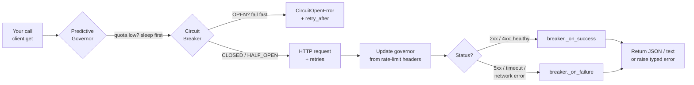
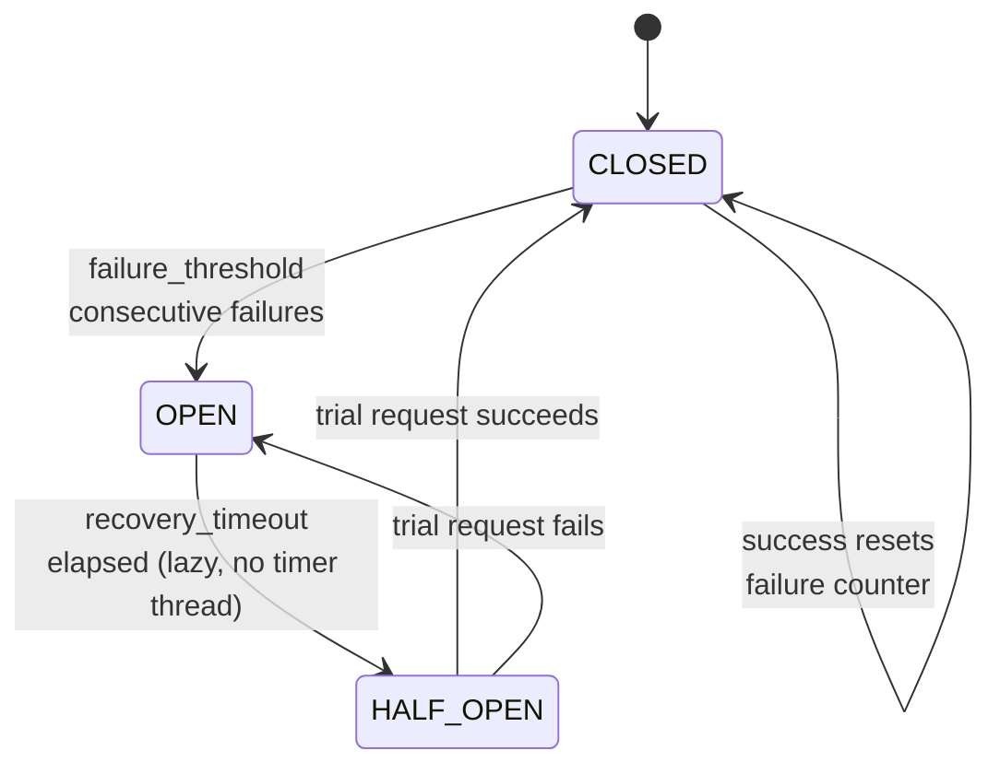
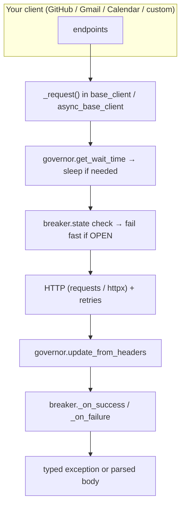

<div align="center">

# 🚀 HakiAPI

### Build production-grade Python API SDKs — not boilerplate.

Authentication · OAuth 2.0 · Retries · **Predictive Rate-Limit Governor** · **Circuit Breaker** · Pagination · Typed Exceptions · Sync + Async

[](https://pypi.org/project/hakiapi/)
[](https://pypi.org/project/hakiapi/)
[](LICENSE)
[](https://github.com/Gugilla-Aakash/hakiapi/actions/workflows/ci.yml)
[](https://docs.astral.sh/ruff/)
[](#testing)
[](#testing)
[](#features)
[](#async-client-core-async_base_clientpy)
[](#resilience-built-in-not-bolted-on)
[](https://pypistats.org/packages/hakiapi)
[](https://hakiapi-docs.hakiapi.workers.dev/docs/auth)

**Stop rewriting authentication, retries, rate-limit handling, and pagination for every API client you build.**

📖 **[Read the full documentation →](https://hakiapi-docs.hakiapi.workers.dev/docs/)**

[Docs](https://hakiapi-docs.hakiapi.workers.dev/docs/) • [What's New](#whats-new-in-v21x) • [Installation](#installation) • [Quick Start](#quick-start) • [Features](#-features) • [Resilience](#resilience-built-in-not-bolted-on) • [Core Concepts](#core-concepts) • [Async Client](#async-client-coreasync_base_clientpy) • [Bundled Clients](#bundled-clients) • [Create Your Own Client](#create-your-own-client) • [Examples](#examples) • [Architecture](#architecture--project-structure) • [Troubleshooting](#troubleshooting) • [Roadmap](#roadmap)

</div>

---

## Table of Contents

- [What's New in v2.1.x](#whats-new-in-v21x)
- [Why HakiAPI?](#why-hakiapi)
- [✨ Features](#-features)
- [Installation](#installation)
- [Quick Start](#quick-start)
- [Resilience: Built In, Not Bolted On](#resilience-built-in-not-bolted-on)
- [Core Concepts](#core-concepts)
- [Bundled Clients](#bundled-clients)
- [Create Your Own Client](#create-your-own-client)
- [Examples](#examples)
- [Architecture & Project Structure](#architecture--project-structure)
- [Design Principles](#design-principles)
- [Testing](#testing)
- [Troubleshooting](#troubleshooting)
- [Roadmap](#roadmap)
- [Contributing](#contributing)
- [License](#license)

---

## What's New in v2.1.x

Current release: **v2.1.6** (`pip install -U hakiapi`).

| New in | Feature | What you get |
|---|---|---|
| v2.1.x | 🧭 **Predictive rate-limit governor** (`core/governor.py`) | `PredictiveGovernor` paces requests proactively from `X-RateLimit-*` / `RateLimit-*` headers. Wired into **both** `BaseAPIClient` and `AsyncBaseAPIClient` by default (`enable_governor=False` to opt out; share one instance across clients to coordinate pacing). |
| v2.1.x | 🧯 **Circuit breaker built into every client** (`core/circuit_breaker.py`) | `CircuitBreaker` (`CLOSED → OPEN → HALF_OPEN`) now runs inside every `_request()` — fails fast with `CircuitOpenError(retry_after=...)` during cooldown, then auto-probes recovery. Still usable standalone as `@breaker`. |
| v2.1.x | ⚡ **Top-level async export + `async` extra** | `from hakiapi import AsyncBaseAPIClient` (also `from hakiapi.core import AsyncBaseAPIClient`). Install with `pip install hakiapi[async]`; importing without `httpx` raises an `ImportError` with that hint. |
| v2.1.x | 📊 **GitHub GraphQL engine + profile aggregation** | `execute_graphql()` (raises `HakiAPIError` on body-level `"errors"`), `get_user_contributions()` (365-day calendar + lifetime PR/issue activity), `fetch_full_profile_data()`, `check_readme_exists()` / `check_top_repos_readmes()`. |
| v2.1.5 | 🔧 **Governor rename (with shim)** | `hakiapi.core.governer` (typo) → `hakiapi.core.governor`. Old path still works via `DeprecationWarning` shim; new code should use `hakiapi.core.governor`. |
| v2.1.6 | 🛡️ **Quality pipeline (`ci.yml`)** | Moderate Ruff (`E,F,I,UP,B,SIM`, 88, py310) + `ruff format`, pytest matrix `3.10–3.14`, coverage gate `≥85%` (382 passed, 93.25%), `mypy`, `bandit` + `pip-audit`. Local auto-fix via `ruff check --fix` + `ruff format`; CI enforces with `--check` fail. |

> Upgrading from ≤ v2.1.4? Only change needed is the governor import if you referenced the old typo'd path — everything else is backward compatible.

---

## Why HakiAPI?

Every API client grows the same infrastructure, in the same order. You start with a simple HTTP call. Then you add authentication. Then retries. Then you get rate-limited at 2 AM and add backoff. Then pagination. Then timeout and exception handling. Then a downstream outage takes your app down with it, and you wish you'd added a circuit breaker. A month later, you've rebuilt the same plumbing you already wrote for the last five projects.

HakiAPI extracts all of that into one reusable core (`BaseAPIClient` / `AsyncBaseAPIClient`), so every client you build on top of it inherits the same battle-tested behavior automatically. Instead of writing infrastructure, you write endpoint logic.

### Raw `requests` vs. HakiAPI

| | Raw `requests` | HakiAPI |
|---|---|---|
| **OAuth 2.0 Flow** | Hand-roll the consent URL, spin up a redirect server, parse the callback yourself | `GoogleOAuthFlow` builds the consent URL, opens the browser, catches the redirect on `localhost`, verifies CSRF `state`, and exchanges the code for you |
| **Token Persistence** | Read/write a JSON file yourself and hope nothing corrupts it mid-write | `FileTokenStore` writes atomically (temp file + `os.replace`) with `0600` permissions |
| **Retry Logic** | Wire up your own `urllib3.Retry` + `HTTPAdapter` | Built into every sync session with exponential backoff on `429/500/502/503/504`; natively re-implemented for `httpx` in the async client |
| **Rate-Limit Pacing** | React to `429`s after they happen — sleep, retry, hope | `PredictiveGovernor` reads `X-RateLimit-*` / `RateLimit-*` response headers and **sleeps proactively** before the next request so the `429` never happens |
| **Static Auth** | Reimplement Bearer/HMAC/API-key headers per project | 5 reusable `AuthBase` strategies, drop-in |
| **Error Handling** | Manually branch on `response.status_code` everywhere | Raised as a typed, catchable exception hierarchy carrying `status_code` and the original `response` |
| **Pagination** | Write a custom `while` loop per API's pagination style | `paginate()` auto-detects Link-header, `data`/`meta.next_token`, `messages`/`nextPageToken`, and `items`/`nextPageToken` styles, yielding lazily |
| **Async I/O** | Swap in `aiohttp`/`httpx` yourself and reimplement retries, timeouts, and status handling on top of it | `AsyncBaseAPIClient` is an `httpx`-backed mirror of `BaseAPIClient` — same retry engine, same governor, same breaker, same typed exceptions, `async`/`await` throughout |
| **Cascading Failures** | A struggling downstream service keeps getting hammered by retries until your own app falls over with it | `CircuitBreaker` is **wired into every client by default** — trips OPEN after N consecutive failures, fails fast with `CircuitOpenError` during cooldown, then auto-probes recovery with a single trial call |

---

## ✨ Features

| Feature | Details |
|---|---|
| 🔐 **Interactive OAuth 2.0 Flow** | `GoogleOAuthFlow` drives Google's Authorization Code flow end-to-end: builds the consent URL, opens the system browser, boots a one-shot local `HTTPServer` to catch the redirect, validates the CSRF `state` token, and exchanges the code for tokens. |
| 🔁 **Manual Token Refresh** | `refresh_access_token()` exchanges a stored `refresh_token` for a new `access_token` without user interaction, and wipes the token store automatically if Google reports the grant as revoked. |
| 🗄️ **Atomic Token Vault** | `FileTokenStore` persists tokens to a local JSON file by writing to a temp file and swapping it in with `os.replace()`, so a crash mid-write can never leave a corrupted token file. The file is `chmod 0600`. |
| 🔐 **Multiple Auth Strategies** | `BearerTokenAuth`, `HeaderApiKeyAuth`, `QueryApiKeyAuth`, `HmacAuth` (SHA-256 request signing), and `OAuth2Auth` for wiring a `GoogleOAuthFlow` directly into a `requests.Session`. |
| 🔁 **Automatic Retries** | `create_retry_adapter()` mounts an `HTTPAdapter` with exponential backoff on `429/500/502/503/504` onto every sync `BaseAPIClient` session (`raise_on_status=False`, so typed exceptions own the final failure). The async client re-implements the same policy natively on `httpx` (exponential backoff + jitter, `Retry-After` clamping at 300s). |
| 🧭 **Predictive Rate-Limit Governor** | `PredictiveGovernor` learns each host's quota from response headers (GitHub-style `X-RateLimit-*` and IETF-draft `RateLimit-*`) and **paces requests proactively** — `time.sleep` (sync) / `await asyncio.sleep` (async) — before you burn the last call and eat a `429`. Thread-safe, per-host registry, tunable `safety_margin`. On by default; disable with `enable_governor=False`. |
| 🧯 **Circuit Breaker (built-in)** | Every `BaseAPIClient` and `AsyncBaseAPIClient` ships with a thread-safe `CircuitBreaker` implementing `CLOSED → OPEN → HALF_OPEN`. Fails fast with `CircuitOpenError` (carrying `retry_after`) once `failure_threshold` consecutive failures are hit, then allows a single trial request after `recovery_timeout` to probe recovery. Also usable as a standalone `@breaker` decorator on any callable. Disable with `enable_circuit_breaker=False`. |
| 📄 **Smart Pagination** | `paginate()` auto-detects GitHub-style `Link` headers, Twitter-style `meta.next_token`, Gmail-style `messages` + `nextPageToken`, and Calendar-style `items` + `nextPageToken` — all as one lazy generator. |
| ⚠️ **Typed Exceptions** | `RateLimitError` (with `retry_after`), `AuthenticationError` (401/403), `ClientError` (4xx), `ServerError` (5xx), `RequestTimeoutError`, `CircuitOpenError` — all inherit from `HakiAPIError`, which carries `status_code` and the original `response`. |
| ⚡ **Async Client** | `AsyncBaseAPIClient` is a fully `async`/`await`, `httpx`-powered counterpart to `BaseAPIClient` — same exponential backoff on `429/500/502/503/504`, same governor + breaker wiring, same typed exception hierarchy, `Retry-After` clamping, SSRF-safe URL/endpoint validation, custom headers, and a max-response-size guard. |
| 📦 **Ready-to-use Clients** | `GitHubClient` (REST + GraphQL + full-profile aggregation + README checks), `GmailClient`, `GoogleCalendarClient` — out of the box. |

---

## Installation

```bash
pip install hakiapi
```

Requires **Python 3.10+**. Core dependencies are `requests>=2.32.0` and `urllib3>=1.26.0`.

`AsyncBaseAPIClient` is built on [`httpx`](https://www.python-httpx.org/), which isn't installed by default — add it if you want the async client:

```bash
pip install hakiapi[async]
```

For development (tests, lint, types, security):

```bash
pip install -e ".[dev,async]"
```

`dev` includes `pytest`, `pytest-asyncio`, `pytest-cov`, `ruff`, `mypy`, `bandit[toml]`, `pip-audit`, `httpx`.

📖 Full API reference and guides: **[hakiapi-docs.hakiapi.workers.dev](https://hakiapi-docs.hakiapi.workers.dev/docs/installation)**

---

## Quick Start

### 1. Interactive OAuth 2.0 (Google Calendar)

`GoogleOAuthFlow.get_token()` checks the `TokenStore` first. If a valid, non-expired token is already saved, it's returned immediately. Otherwise it opens your browser, runs the full consent flow, and persists the result:

```python
import os
from dotenv import load_dotenv
from hakiapi.clients.google_calendar import GoogleCalendarClient
from hakiapi.core.oauth.google import GoogleOAuthFlow
from hakiapi.core.oauth.token_store import FileTokenStore

# Load variables from your .env file into os.environ
load_dotenv()

# 1. Set up the flow and the token vault
oauth_flow = GoogleOAuthFlow(
    client_id=os.environ["GOOGLE_CLIENT_ID"],
    client_secret=os.environ["GOOGLE_CLIENT_SECRET"],
    scopes=["https://www.googleapis.com/auth/calendar.readonly"],
    store=FileTokenStore("my_secure_token.json"),
    redirect_port=8765,  # must match an authorized redirect URI in Google Cloud Console
)

# 2. get_token() returns the cached token if it's still valid,
#    otherwise it opens the browser and runs the full consent flow.
#    Pass force=True to re-run consent even when a valid token exists.
token = oauth_flow.get_token()

# 3. Initialize your client with the raw access token
with GoogleCalendarClient(token=token.access_token) as calendar:
    for event in calendar.events.upcoming(max_results=3):
        print(event.get("summary"))
```

> **Note:** `get_token()` does **not** silently refresh an expired token — it re-runs the interactive consent flow when the stored token is missing or expired. If you want silent, non-interactive refreshes using a saved `refresh_token`, call `refresh_access_token()` from `hakiapi.core.oauth.refresh` explicitly (see [OAuth 2.0](#oauth-20-coreoauth) below).

### 2. Automatic Pagination (GitHub)

Forget page numbers, `while` loops, and manually checking for a `next` page. `paginate()` follows Link headers automatically and yields lazily:

```python
from hakiapi.clients.github import GitHubClient

with GitHubClient() as github:
    # Lazily walks every page of the user's public repos
    for repo in github.get_all_user_repos("torvalds"):
        print(repo["name"])
```

### 3. Async Requests (`httpx`-based)

`AsyncBaseAPIClient` mirrors `BaseAPIClient` method-for-method, just with `async`/`await` — including the governor and circuit breaker:

```python
import asyncio
from hakiapi import AsyncBaseAPIClient

async def main():
    async with AsyncBaseAPIClient(base_url="https://api.github.com") as client:
        user = await client.get("/users/torvalds")
        print(user["name"])

asyncio.run(main())
```

### 4. Tuning (or disabling) resilience

The governor and circuit breaker are on by default because production readiness should be the default. Override per client when you need to:

```python
from hakiapi import BaseAPIClient
from hakiapi.core.circuit_breaker import CircuitBreaker
from hakiapi.core.governor import PredictiveGovernor

# Custom tuning: trip sooner, keep a wider rate-limit safety margin
client = BaseAPIClient(
    base_url="https://api.example.com",
    governor=PredictiveGovernor(safety_margin=5),
    circuit_breaker=CircuitBreaker(failure_threshold=3, recovery_timeout=15.0),
)

# Or opt out entirely (e.g. for local mocks / tests)
bare = BaseAPIClient(
    base_url="http://localhost:8000",
    enable_governor=False,
    enable_circuit_breaker=False,
)
```

### 5. Self-authenticating clients (`OAuth2Auth`) + silent refresh

`OAuth2Auth` wraps any flow object exposing `get_token()` and injects a fresh `Authorization: Bearer` header on **every** request — no manual token plumbing in your endpoint methods:

```python
from hakiapi import BaseAPIClient
from hakiapi.core.auth import OAuth2Auth

class MyGoogleClient(BaseAPIClient):
    def __init__(self, oauth_flow, **kwargs):
        super().__init__(
            base_url="https://www.googleapis.com/calendar/v3",
            auth=OAuth2Auth(oauth_flow),  # calls flow.get_token() per request
            **kwargs,
        )
```

Expired but refreshable? Refresh silently without opening a browser — and if Google reports the grant as revoked, the store is wiped automatically so the next `get_token()` falls back to the interactive flow:

```python
import os

from hakiapi.core.oauth.refresh import refresh_access_token

stored = oauth_flow.store.get_token()
if stored is not None and stored.is_expired and stored.refresh_token:
    token = refresh_access_token(
        stored,
        client_id=os.environ["GOOGLE_CLIENT_ID"],
        client_secret=os.environ["GOOGLE_CLIENT_SECRET"],
        store=oauth_flow.store,
    )
else:
    token = oauth_flow.get_token()
```

> `get_token()` itself never refreshes silently — it returns the cached token when valid, otherwise re-runs interactive consent (pass `force=True` to re-run consent unconditionally). Wire `refresh_access_token()` in yourself when you want non-interactive renewal.

---

## Resilience: Built In, Not Bolted On

Retries help you survive a failure. The governor helps you **avoid** one, and the breaker helps you **stop amplifying** one. Every request through any HakiAPI client flows through this pipeline — no extra code required:



Three layers, three jobs:

| Layer | Job | Where it lives |
|---|---|---|
| **Retry engine** | Survive transient blips (`429/500/502/503/504`) with exponential backoff | `core/retry.py` (sync, via `HTTPAdapter`) · native backoff + jitter in `AsyncBaseAPIClient` |
| **`PredictiveGovernor`** | *Prevent* `429`s by sleeping proactively when headers say quota is nearly gone | `core/governor.py`, wired into `_request()` pre- and post-flight |
| **`CircuitBreaker`** | *Stop hammering* a dead downstream: fail fast, then probe recovery with one trial call | `core/circuit_breaker.py`, wired into `_request()` pre- and post-flight; also works as `@breaker` decorator |

The circuit breaker state machine:



> **Migration note:** the governor module was renamed from `hakiapi.core.governer` (typo) to `hakiapi.core.governor` in v2.1.5. The old import path still works via a deprecation shim (`DeprecationWarning`), but new code should import from `hakiapi.core.governor`.

---

## Core Concepts

### Exception Handling

Every exception raised by `BaseAPIClient._request()` (and its async twin) inherits from `HakiAPIError`, carrying `status_code` and the original `response` object:

```python
from hakiapi.core.exceptions import AuthenticationError, RateLimitError, ServerError

try:
    github.get_user("torvalds")
except RateLimitError as e:
    print(f"Rate limited — retry after {e.retry_after}s")
except AuthenticationError:
    print("Invalid credentials.")
except ServerError:
    print("GitHub is currently unavailable.")
```

| Exception | Raised when | Extra attributes |
|---|---|---|
| `RateLimitError` | HTTP `429` | `retry_after` — parsed from the `Retry-After` header, if present (async clamps to ≤300s) |
| `AuthenticationError` | HTTP `401` / `403` | `auth_method` |
| `ClientError` | Any other `4xx` | — |
| `ServerError` | Any `5xx` | — |
| `RequestTimeoutError` | The request times out at the network level (no HTTP response was ever received) | `timeout_duration` |
| `CircuitOpenError` | Call blocked because the breaker is OPEN (no HTTP request was made) | `retry_after` — seconds left in cooldown, clamped to `>= 0` |
| `OAuthFlowError` | Interactive consent / code exchange / silent refresh fails (`hakiapi.core.oauth.google`) | Inherits `HakiAPIError` (`message`, `status_code`, `response`) |

One `except HakiAPIError` block works for both sync and async clients — they raise from the exact same `hakiapi.core.exceptions` module (`CircuitOpenError` lives in `hakiapi.core.circuit_breaker`, `OAuthFlowError` in `hakiapi.core.oauth.google`, both subclassing `HakiAPIError`).

### Authentication Strategies (`core/auth.py`)

All strategies implement `requests.auth.AuthBase`, so they drop straight into `BaseAPIClient(auth=...)`:

```python
from hakiapi.core.auth import BearerTokenAuth, HeaderApiKeyAuth, QueryApiKeyAuth, HmacAuth, OAuth2Auth
```

- **`BearerTokenAuth(token)`** — sets `Authorization: Bearer <token>`.
- **`HeaderApiKeyAuth(header_name, api_key)`** — injects the key under a custom header.
- **`QueryApiKeyAuth(param_name, api_key)`** — appends the key as a query parameter, preserving any existing query string (duplicate keys kept).
- **`HmacAuth(api_key, secret_key, ...)`** — signs each request with HMAC-SHA256 over `METHOD\nPATH\nTIMESTAMP\nBODY` (newline-delimited to prevent field-collision signature forgery), sending the key, timestamp, and signature as headers. Customizable header names via `api_key_header` / `signature_header` / `timestamp_header`. Raises `TypeError` for streaming bodies, which aren't supported, and `ValueError` if the request has no HTTP method to sign.
- **`OAuth2Auth(flow)`** — wraps any object exposing `get_token()` (like `GoogleOAuthFlow`) and injects a fresh `Authorization: Bearer` header on every request. See [Quick Start §5](#quick-start) for a full `BaseAPIClient(auth=OAuth2Auth(flow))` example.

### Retry Engine (`core/retry.py` + async native retries)

`create_retry_adapter()` builds an `HTTPAdapter` backed by `urllib3.util.Retry`:

- **3 retries by default**, with an exponential `backoff_factor` of `1.0`.
- Retries on `429, 500, 502, 503, 504` by default (configurable via `status_forcelist`; HTTP methods via `allowed_methods`).
- `raise_on_status=False` — `urllib3` never raises on its own; HakiAPI's typed exceptions handle the final failure.
- Mounted on both `http://` and `https://` for every sync `BaseAPIClient` session automatically.

The async client can't mount a `urllib3` adapter onto `httpx`, so it re-implements the same policy inside `_request()`: exponential backoff (`backoff_factor * 2**attempt` plus jitter) on `429/500/502/503/504` plus `httpx.TimeoutException` / `httpx.RequestError`, up to `max_retries` (default 3, `backoff_factor` default 0.5). A valid `Retry-After` header on a `429` sleeps exactly that long (clamped to 300s) instead of the backoff curve.

### Predictive Governor (`core/governor.py`)

The governor answers one question before every request: *"does the last response say we're almost out of quota?"* If yes, it sleeps just long enough for the quota window to reset — turning a would-be `429` into a slightly slower `200`.

```python
from hakiapi import BaseAPIClient
from hakiapi.core.governor import PredictiveGovernor

# Keep 5 calls of headroom instead of the default 1
client = BaseAPIClient(
    base_url="https://api.github.com",
    governor=PredictiveGovernor(safety_margin=5),
)

# The governor learns automatically — no per-request code needed.
# After each response it reads the rate-limit headers;
# before each request it sleeps only if the budget is exhausted.
```

How it works:

| Step | Detail |
|---|---|
| **Per-host registry** | Quota state is keyed by `base_url`, so one client never confuses GitHub's quota with Gmail's. Unknown hosts cost `0.0s` (no sleep). |
| **Header parsing** | Supports GitHub-style (`X-RateLimit-Remaining` + `X-RateLimit-Reset` as epoch seconds) and IETF-draft (`RateLimit-Remaining` + `RateLimit-Reset` as delta-seconds), matched case-insensitively. Unrecognized or malformed headers leave state untouched. |
| **`safety_margin`** | Sleep kicks in when `remaining <= safety_margin` (default `1`). Raise it for spiky workloads; lower to `0` to live dangerously. |
| **Expiry handling** | If the stored `reset_timestamp` has already passed, the governor resets the budget to infinity and returns `0.0` — no stale blocks. |
| **Pacing** | Sync sleeps with `time.sleep(wait)`; async sleeps with `await asyncio.sleep(wait)` so the event loop stays free. |
| **Thread-safety** | All registry reads/writes are guarded by a single `threading.Lock`. |
| **Opt-out** | `BaseAPIClient(..., enable_governor=False)` (same for async), or inject a shared `PredictiveGovernor` across clients to coordinate pacing. |

### Circuit Breaker (`core/circuit_breaker.py`)

`CircuitBreaker` protects downstream services from cascading failures. Since v2.1.x it is **wired into every client automatically** — and it still works as a standalone decorator for anything else:

```python
from hakiapi.core.circuit_breaker import CircuitBreaker, CircuitOpenError
from hakiapi.core.exceptions import HakiAPIError

breaker = CircuitBreaker(
    failure_threshold=5,      # consecutive failures before the circuit opens
    recovery_timeout=30.0,    # seconds to wait before allowing a trial request
    expected_exceptions=(HakiAPIError,),  # exception types that count as failures
)

@breaker
def get_user(user_id: str):
    return github.get_user(user_id)

try:
    get_user("torvalds")
except CircuitOpenError as e:
    print(f"Downstream is unhealthy — retry in {e.retry_after:.1f}s")
```

Built-in wiring (both sync and async `_request()`):

1. **Pre-flight check** — if the breaker `state == OPEN`, raise `CircuitOpenError(retry_after=cooldown_left)` without touching the network.
2. **Failure tracking** — timeouts, network errors, and `5xx` responses call `_on_failure()`. (Async treats `4xx`/`2xx` as "server is alive" → `_on_success()`; sync resets on any non-`5xx` that reaches response handling.)
3. **Tuning / opt-out** — pass `circuit_breaker=CircuitBreaker(...)` or `enable_circuit_breaker=False` to either client constructor.

State machine reference:

| State | Behavior |
|---|---|
| **`CLOSED`** | Normal operation. Requests pass through; a successful call resets the failure counter. |
| **`OPEN`** | Failing fast. Every call is blocked instantly with `CircuitOpenError` (no call is made to the wrapped function) until `recovery_timeout` seconds have elapsed. |
| **`HALF_OPEN`** | Testing recovery. Once the timeout elapses, a single trial request is allowed through — success closes the circuit and resets the counter, failure reopens it immediately and restarts the cooldown. |

- **Thread-safe.** All state transitions and counters are guarded by a single `threading.Lock`, so one `CircuitBreaker` instance can safely protect a callable shared across threads.
- **Lazy state evaluation.** The `OPEN → HALF_OPEN` transition happens the moment `state` is read (or a wrapped call is made) after `recovery_timeout` has elapsed — there's no background timer or polling thread.
- **`CircuitOpenError`** inherits from `HakiAPIError` and carries `retry_after` (seconds remaining in the cooldown, clamped to `>= 0`), so callers can back off intelligently instead of guessing.
- **Configurable failure scope.** `expected_exceptions` controls which exception types trip the breaker — defaults to `HakiAPIError`, so unrelated exceptions (e.g. a `ValueError` from bad input) pass straight through without affecting circuit state.
- **Self-clamping configuration.** `failure_threshold` is floored at `1` and `recovery_timeout` at `0.1` seconds, so a misconfigured `0` or negative value can't accidentally create a circuit that never opens or reopens instantly forever.

### Async Client (`core/async_base_client.py`)

`AsyncBaseAPIClient` is a ground-up, `httpx`-backed implementation for `asyncio` codebases — not a thin wrapper around the sync client:

```python
from hakiapi import AsyncBaseAPIClient

async with AsyncBaseAPIClient(
    base_url="https://api.example.com",
    timeout=10.0,
    max_retries=3,
    backoff_factor=0.5,
    max_response_bytes=10 * 1024 * 1024,
    headers={"X-Team": "haki"},
    enable_governor=True,            # default True
    enable_circuit_breaker=True,     # default True
) as client:
    data = await client.get("/resource")
    created = await client.post("/resource", json={"name": "haki"})
```

- **Same resilience stack.** Governor pacing (`await asyncio.sleep`), breaker pre-flight + tracking, and native retry/backoff all run inside the async `_request()` loop.
- **`Retry-After`-aware.** A `429` with a valid `Retry-After` header sleeps for exactly that long (clamped to 300s) instead of the backoff curve; HTTP-date formats are ignored safely.
- **Same typed exception hierarchy.** Imported from the same `hakiapi.core.exceptions` module — one `except` block covers both clients.
- **SSRF-safe.** `base_url` must be `http(s)` with a real host (validated at construction); every `endpoint` must be a relative path — absolute or protocol-relative values raise `ValueError`. Redirects are never followed automatically (`follow_redirects=False`).
- **Response-size guard.** Bodies larger than `max_response_bytes` raise `HakiAPIError` before being handed back, checked against `Content-Length` when present.
- **Strict methods.** `GET/POST/PUT/DELETE/PATCH/HEAD/OPTIONS` accepted; anything else raises `ValueError`. (`get/post/put/delete/patch` helpers cover the common five; the rest go through `_request()`.)
- **Lifecycle.** `async with ...` calls `close()` (which awaits `httpx.AsyncClient.aclose()`) on exit; `close()` is idempotent. `repr()` is safe (`AsyncBaseAPIClient(base_url=...)`).
- **`get`, `post`, `put`, `delete`, `patch`** all `await` through the same `_request()` pipeline and accept `raw_response=True` for the raw `httpx.Response`.

> **Note:** `AsyncBaseAPIClient` is re-exported from the top-level `hakiapi` package (`from hakiapi import AsyncBaseAPIClient`) and from `hakiapi.core`. It requires the `async` extra (`pip install hakiapi[async]`); importing it without `httpx` installed raises an `ImportError` with that hint.

### Smart Pagination (`core/paginator.py`)

`paginate(client, endpoint, max_pages=None, **kwargs)` is a generator that keeps requesting pages until it runs out, detecting the item list and the "next page" signal from the response shape:

| Response shape | Items key | Next-page signal |
|---|---|---|
| Raw JSON list | the list itself | `Link` response header (`rel="next"`) |
| `{"data": [...], "meta": {...}}` (Twitter/X-style) | `data` | `meta.next_token` |
| `{"messages": [...], "nextPageToken": ...}` (Gmail-style) | `messages` | `nextPageToken` |
| `{"items": [...], "nextPageToken": ...}` (Calendar-style) | `items` | `nextPageToken` |
| `{"resultSizeEstimate": 0}` (Gmail empty result) | — | stops cleanly, no error |

Any other shape raises `ValueError("Unexpected pagination response: ...")`. Pass `max_pages` to cap how many pages are fetched. GitHub `Link`-header pagination follows the `next` URL's path + query automatically.

Use it directly in your own clients — no subclassing required:

```python
from hakiapi import BaseAPIClient
from hakiapi.core.paginator import paginate

with BaseAPIClient(base_url="https://api.github.com") as client:
    # Works with any paginated endpoint paginate() understands
    for repo in paginate(client, "users/torvalds/repos", max_pages=3):
        print(repo["full_name"])
```

### OAuth 2.0 (`core/oauth/`)

The OAuth engine is split into three independent pieces:

- **`token_store.py`** — `OAuthToken` (a dataclass with `access_token`, `refresh_token`, `expires_at`, `scopes`, and an `is_expired` property with a 30-second leeway buffer) and the `TokenStore` abstract base class (`get_token` / `save_token` / `delete_token`). `FileTokenStore` is the concrete implementation: it serializes tokens to JSON, writes atomically via a temp file + `os.replace()`, creates parent dirs as needed, rejects empty files (`None`) and invalid JSON (`ValueError`), and sets `0600` permissions on the file.
- **`google.py`** — `GoogleOAuthFlow` drives the full interactive Authorization Code flow: builds the consent URL (`access_type=offline`, `prompt=consent` to force a refresh token on every run), opens it with `webbrowser.open()`, boots a one-shot `http.server.HTTPServer` on `localhost:<redirect_port>` to catch the redirect, validates the CSRF `state` parameter, and exchanges the authorization code for tokens via a direct POST to Google's token endpoint. Raises `OAuthFlowError` on denial, timeout, port conflicts, a `state` mismatch, or a failed exchange. `get_token(force=False)` returns the cached token when valid; `force=True` re-runs consent unconditionally.
- **`refresh.py`** — `refresh_access_token(token, client_id, client_secret, store)` is a standalone function that exchanges a saved `refresh_token` for a new `access_token` without opening a browser. If Google rejects the refresh (revoked/invalid grant), it calls `store.delete_token()` so the next `get_token()` call cleanly falls back to the interactive flow. Requires the stored token to carry a `refresh_token` (raises `ValueError` otherwise); preserves the old refresh token and scopes when Google doesn't return new ones.

```python
from hakiapi.core.oauth.refresh import refresh_access_token

current = flow.store.get_token()
if current and current.refresh_token:
    try:
        current = refresh_access_token(
            current,
            client_id="...",
            client_secret="...",
            store=flow.store,  # updated in place on success, wiped on revocation
        )
    except Exception:
        current = flow.get_token()  # fall back to interactive consent
```

These three pieces are intentionally decoupled — `GoogleOAuthFlow.get_token()` only checks expiry and re-runs the interactive flow if needed; wiring in silent refreshes via `refresh_access_token()` is left to the caller (or to `OAuth2Auth`, once you build that logic into your own `flow` object).

`OAuthFlowError` (raised for denial, timeout, port conflicts, `state` mismatch, or failed exchange/refresh) inherits from `HakiAPIError`, so a single `except HakiAPIError` covers both transport and OAuth failures.

---

## Bundled Clients

All clients are importable from the top level — `from hakiapi import GitHubClient, GmailClient, GoogleCalendarClient, BaseAPIClient, AsyncBaseAPIClient` — or from their module paths (`hakiapi.clients.github`, `hakiapi.clients.gmail`, `hakiapi.clients.google_calendar`). `hakiapi.__version__` reports the installed version.

### `GitHubClient` — REST + GraphQL + profile aggregation

```python
from hakiapi import GitHubClient

with GitHubClient(token="ghp_...") as gh:  # token is optional for public endpoints
    gh.get_user("torvalds")
    gh.search_users("location:hyderabad")
    gh.get_all_search_users("python")                # auto-paginated generator
    gh.get_user_repos("torvalds")                    # single page
    gh.get_all_user_repos("torvalds")                # auto-paginated generator
    gh.get_repo_languages("torvalds", "linux")
    gh.get_aggregate_user_languages("torvalds")      # sums languages across every repo
    gh.get_user_authored_activity("torvalds")        # recent authored PRs + issues
    gh.check_readme_exists("torvalds", "linux")      # True / False via HEAD
    gh.check_top_repos_readmes("torvalds", repos)    # top-N owned repos -> bool map
    gh.execute_graphql(query, variables={...})       # raises HakiAPIError on GraphQL-level errors
    gh.get_user_contributions("torvalds", from_date="2025-01-01T00:00:00Z")
    gh.fetch_full_profile_data("torvalds")           # one-call profile aggregation
```

`get_aggregate_user_languages()` walks every repository returned by `get_all_user_repos()` and silently skips any repo whose language lookup raises `HakiAPIError`, so one broken/empty repo doesn't fail the whole aggregation.

#### GraphQL Engine

`GitHubClient` isn't purely REST — it also ships a GraphQL execution layer on top of the same `BaseAPIClient` infrastructure, so GraphQL calls get the same retries, governor pacing, breaker protection, timeout handling, and auth as everything else.

```python
from hakiapi.clients.github import GitHubClient

with GitHubClient(token="ghp_...") as gh:
    data = gh.execute_graphql(
        """
        query($login: String!) {
            user(login: $login) {
                name
                bio
            }
        }
        """,
        variables={"login": "torvalds"},
    )
    print(data["user"]["name"])
```

- **`execute_graphql(query, variables=None, **kwargs)`** — the low-level engine. It `POST`s `{"query": ..., "variables": ...}` to GitHub's `/graphql` endpoint and unwraps the response. GraphQL is notorious for returning HTTP `200 OK` even when the query itself failed, with the real error buried in the response body — `execute_graphql` checks for an `"errors"` key in the payload and raises a `HakiAPIError` joining every message it finds, instead of letting a broken query silently return `None`. On success it returns just the `"data"` portion of the payload.
- **`get_user_contributions(username, from_date=None, to_date=None, **kwargs)`** — a ready-made query built on top of `execute_graphql`. It fetches a 365-day contribution calendar (total + weekly `contributionDays` breakdown) and lifetime PR/issue counts with recent nodes, optionally scoped to a date range. `from_date`/`to_date` must be ISO 8601 strings (e.g. `"2025-01-01T00:00:00Z"`). Returns `{}` when the user isn't found. Shape:
  ```python
  {
      "recent_contributions_365_days": {
          "total_contributions": 1200,
          "weeks": [{"contributionDays": [{"date": "...", "contributionCount": 3}]}],
      },
      "lifetime_activity": {
          "pull_requests": {"total_count": 42, "recent_items": [...]},
          "issues": {"total_count": 17, "recent_items": [...]},
      },
  }
  ```

#### Profile aggregation & README checks

- **`check_readme_exists(owner, repo_name, **kwargs)`** — `HEAD`s GitHub's canonical `repos/{owner}/{repo}/readme` endpoint (5s default timeout). Returns `True` on `200`, `False` on `404` or any `HakiAPIError` — it never raises for a missing README.
- **`check_top_repos_readmes(owner, repos, top_n=5, **kwargs)`** — filters out forks, sorts owned repos by `stargazers_count` descending, checks the top N, and returns `{repo_name: has_readme}`.
- **`fetch_full_profile_data(username, **kwargs)`** — one call that aggregates everything: latest-100 repos (sorted by `updated`), a primary-language breakdown, the contribution + lifetime activity payload above, top-5 README statuses, and each repo object annotated with a `has_readme` flag (`True`/`False`, or `None` when outside the top N). Ideal for profile pages and dashboards.

### `GmailClient` — resource-based routing

```python
from hakiapi import GmailClient

with GmailClient(token=access_token) as gmail:
    gmail.profile.get()                    # users/{id}/profile
    gmail.labels.list()                    # users/{id}/labels
    gmail.messages.get(message_id)         # a single message
    gmail.messages.list(max_pages=2)       # auto-paginated generator
    gmail.messages.search("is:unread")     # auto-paginated generator with a query
    gmail.messages.send({"raw": base64_rfc2822_string})
```

`messages.send()` requires the payload dict to carry a `raw` key with a base64url-encoded RFC 2822 string.

### `GoogleCalendarClient` — resource-based routing

```python
from hakiapi import GoogleCalendarClient

with GoogleCalendarClient(token=access_token) as cal:
    cal.calendars.list(max_pages=1)
    cal.events.get(event_id)
    cal.events.list(calendar_id="primary")
    cal.events.today()                       # midnight-to-midnight UTC, recurring events expanded
    cal.events.upcoming(max_results=5)        # next N events from now, single page
    cal.events.create({"summary": "...", "start": {...}, "end": {...}})
    cal.events.delete(event_id)
```

`today()` and `upcoming()` both auto-fill `timeMin`/`timeMax`, set `singleEvents=True` to expand recurring events, and sort by `startTime` — you only pass the calendar ID.

---

## Create Your Own Client

Subclass `BaseAPIClient`, point it at a base URL, and define your endpoints as plain methods. Authentication, retries, governor pacing, breaker protection, timeout handling, and typed exceptions are inherited automatically:

```python
from hakiapi import BaseAPIClient

class WeatherClient(BaseAPIClient):
    def __init__(self, **kwargs):
        super().__init__(base_url="https://api.open-meteo.com/v1", **kwargs)

    def get_weather(self, latitude: float, longitude: float):
        return self.get(
            "forecast",
            params={
                "latitude": latitude,
                "longitude": longitude,
                "current_weather": True,
            },
        )

if __name__ == "__main__":
    # Hyderabad, Telangana, India
    with WeatherClient() as client:
        weather = client.get_weather(latitude=17.385, longitude=78.4867)
        print(weather["current_weather"])
```

`BaseAPIClient` exposes `get`, `post`, `put`, `patch`, and `delete`, all routed through `_request()`, which handles the retry-mounted session, governor pacing, breaker checks/tracking, timeout errors, status-code-to-exception mapping, and JSON/text response parsing (falling back to `response.text` if the body isn't valid JSON). Pass `raw_response=True` to get the raw `requests.Response` instead — this is what `paginate()` uses internally to read the `Link` header.

#### Per-request options (both sync and async)

Every verb accepts the same passthrough kwargs — they go straight to `requests` / `httpx`:

| Option | Example | Notes |
|---|---|---|
| `params` | `client.get("search/users", params={"q": "torvalds"})` | Query string; `paginate()` manages page cursors for you when you use it |
| `json` / `data` | `client.post("resource", json={...})` | Request body |
| `headers` | `client.get("resource", headers={"X-Trace": "1"})` | Merged over session defaults per request |
| `timeout` | `client.get("resource", timeout=5.0)` | Overrides the client's default `timeout` (10s) for that call only; timeouts raise `RequestTimeoutError` carrying `timeout_duration` |
| `raw_response` | `client.get("resource", raw_response=True)` | Returns the raw `requests.Response` / `httpx.Response` (needed for `Link` headers, streaming, etc.) |
| `auth` caveat | `BaseAPIClient(..., auth=(user, pw))` | Besides the 5 `AuthBase` strategies, sync `BaseAPIClient` also accepts a `(username, password)` tuple (HTTP Basic via `requests`); the async client passes `auth` through to `httpx` instead |

#### Coordinating clients: shared governor + breaker inspection

```python
from hakiapi import BaseAPIClient
from hakiapi.core.circuit_breaker import CircuitState
from hakiapi.core.governor import PredictiveGovernor

# One governor shared across clients paces them as a group
# (state is keyed by base_url, so same-host clients coordinate).
shared_governor = PredictiveGovernor(safety_margin=2)
a = BaseAPIClient(base_url="https://api.github.com", governor=shared_governor)
b = BaseAPIClient(base_url="https://api.github.com", governor=shared_governor)

# Inspect breaker health any time (lazy OPEN → HALF_OPEN transition included)
if a.circuit_breaker and a.circuit_breaker.state == CircuitState.OPEN:
    print("GitHub downstream is cooling down — expect CircuitOpenError fast-fails.")
```

Need async? Subclass `AsyncBaseAPIClient` instead — same pattern, `async def` methods, `await self.get(...)`:

```python
from hakiapi import AsyncBaseAPIClient

class AsyncWeatherClient(AsyncBaseAPIClient):
    def __init__(self, **kwargs):
        super().__init__(base_url="https://api.open-meteo.com/v1", **kwargs)

    async def get_weather(self, latitude: float, longitude: float):
        return await self.get(
            "forecast",
            params={"latitude": latitude, "longitude": longitude, "current_weather": True},
        )
```

---

## Examples

Runnable scripts live in [`examples/`](examples/) (plus [`example_oauth.py`](example_oauth.py) at the repo root for the end-to-end Google consent flow):

| Script | Shows |
|---|---|
| `examples/example_github.py` | `GitHubClient` REST + search + auto-pagination + language aggregation + `execute_graphql` + contributions (`GITHUB_TOKEN`) |
| `examples/example_gmail.py` | `GmailClient` profile / labels / `messages.search` + `messages.get` with `max_pages` safety valve (`GMAIL_OAUTH_TOKEN`) |
| `examples/example_google_calender.py` | `GoogleCalendarClient` calendar list + `events.today()` / `events.upcoming()` / `events.get()` (`GOOGLE_CALENDAR_TOKEN`) |
| `example_oauth.py` | `GoogleOAuthFlow.get_token()` → `GoogleCalendarClient(token=...)` → `events.upcoming(max_results=5)` (`GOOGLE_CLIENT_ID` / `GOOGLE_CLIENT_SECRET`) |

```bash
export GITHUB_TOKEN="ghp_..."
python examples/example_github.py
```

---

## Architecture & Project Structure

```text
hakiapi/
├── core/
│   ├── oauth/
│   │   ├── google.py         # GoogleOAuthFlow — interactive Authorization Code flow
│   │   ├── refresh.py        # refresh_access_token() — silent refresh via refresh_token
│   │   └── token_store.py    # OAuthToken, TokenStore (ABC), FileTokenStore
│   ├── auth.py                # BearerTokenAuth, HeaderApiKeyAuth, QueryApiKeyAuth, HmacAuth, OAuth2Auth
│   ├── retry.py                # create_retry_adapter() — exponential-backoff HTTPAdapter factory
│   ├── governor.py             # PredictiveGovernor — proactive rate-limit pacing (GitHub + IETF headers)
│   │                           # (hakiapi.core.governer remains as a deprecated shim)
│   ├── circuit_breaker.py      # CircuitBreaker — CLOSED/OPEN/HALF_OPEN fail-fast decorator + built-in wiring
│   ├── paginator.py            # paginate() — Link-header + token-based pagination
│   ├── base_client.py          # BaseAPIClient — session, retries, governor, breaker, exception mapping
│   ├── async_base_client.py    # AsyncBaseAPIClient — httpx-based async counterpart (same guarantees)
│   └── exceptions.py           # HakiAPIError hierarchy (+ CircuitOpenError lives in circuit_breaker.py)
│
└── clients/
    ├── github.py               # GitHubClient — REST + GraphQL + profile aggregation + README checks
    ├── gmail.py                # GmailClient — profile / labels / messages resources
    └── google_calendar.py      # GoogleCalendarClient — calendars / events resources
```

Every request's journey through the core:



---

## Design Principles

* Infrastructure should be written once.
* API clients should remain lightweight.
* Explicit is better than magical.
* Strong typing improves maintainability.
* Production readiness should be the default, not an afterthought.
* Developer experience matters as much as correctness.

---

## Testing

```bash
pip install -e ".[dev,async]"
ruff check hakiapi tests
ruff format --check hakiapi tests
pytest
mypy hakiapi
bandit -r hakiapi -q
pip-audit
```

* ✅ **382 tests passing, 93.25% coverage (gate ≥85%)** — verified locally on Python 3.14; CI runs matrix `3.10–3.14` via `.github/workflows/ci.yml`
* ✅ Lint: moderate Ruff (`E,F,I,UP,B,SIM`, line-length 88, py310) + `ruff format`; auto-fix locally with `ruff check --fix` + `ruff format`, CI enforces `--check` fail
* ✅ Types: `mypy hakiapi` clean (`asyncio_mode=strict` for tests)
* ✅ Security: `bandit` clean (2 `nosec` false positives: `B311` retry jitter in `async_base_client.py`, `B105` public OAuth URL in `oauth/google.py`); `pip-audit` in CI
* ✅ Core framework covered: `auth` (33), `retry` (25), `circuit_breaker` (19), `governor` (7), `paginator` (22), `base_client` (72), `async_base_client` (35), `exceptions` (21)
* ✅ `AsyncBaseAPIClient` covered end-to-end via `httpx.MockTransport` — success paths, retry/backoff, `Retry-After` handling, timeouts, SSRF/endpoint validation, response-size limits, governor + breaker integration, and context-manager lifecycle
* ✅ `CircuitBreaker` covered end-to-end — standalone state transitions (`CLOSED → OPEN → HALF_OPEN`), threshold clamping, `retry_after` calculation, success-resets-counter behavior, unexpected-exception passthrough (with `time.monotonic` mocked), plus integration tests proving both sync and async clients track failures, fast-fail when OPEN, and reset on success
* ✅ `PredictiveGovernor` covered — no-state passthrough, safety-margin gating, wait-time math, stale-reset recovery, GitHub + IETF header parsing (case-insensitive), unknown-header tolerance, plus `governer` shim deprecation test (1)
* ✅ Full OAuth 2.0 engine covered: `google.py` interactive flow (18), `refresh.py` silent refresh (5), fully mocked
* ✅ `FileTokenStore` atomic-write behavior covered (37)
* ✅ `GitHubClient` (42), `GmailClient` (13), `GoogleCalendarClient` (32) covered

> **Note:** async tests require `pytest-asyncio` (included in the `dev` extra). If you run `pytest` with a bare environment and see `async def functions are not natively supported`, install the dev extra first.

---

## Troubleshooting

| Symptom | Cause → Fix |
|---|---|
| `ImportError: AsyncBaseAPIClient requires the 'async' extra` | `httpx` isn't installed → `pip install hakiapi[async]` |
| `async def functions are not natively supported` under `pytest` | Missing `pytest-asyncio` → `pip install hakiapi[dev]` |
| `OAuthFlowError: Couldn't start the local server on port 8765` | Port already in use → pass a free `redirect_port=` **and** register `http://localhost:<port>/` as an authorized redirect URI in Google Cloud Console |
| `OAuthFlowError: ... 'state' ... didn't match` | Forged or stale redirect → abort is intentional; re-run `get_token(force=True)` for a fresh `state` |
| Token keeps expiring mid-session | `get_token()` doesn't auto-refresh → call `refresh_access_token()` when `token.is_expired` (30s leeway) and a `refresh_token` exists |
| `RateLimitError` despite the governor | Governor only learns from `X-RateLimit-*` / `RateLimit-*` headers; APIs without those headers can't be paced proactively — raise `safety_margin` or catch `RateLimitError.retry_after` and sleep |
| `CircuitOpenError` on every call | Breaker is in cooldown after `failure_threshold` consecutive 5xx/timeouts → back off for `e.retry_after` seconds; inspect `client.circuit_breaker.state`; disable per-client with `enable_circuit_breaker=False` for local mocks |
| `ValueError: endpoint must be a relative path` (async) | Absolute/protocol-relative endpoint → pass a relative path (`"users/me"`, not `"https://..."`); sync client joins `base_url + endpoint` without this guard |
| `ValueError: Unsupported base_url scheme` (async) | `base_url` must be `http(s)` with a host; sync client only strips trailing `/` |
| `HakiAPIError: Response body ... exceeds max_response_bytes` (async) | Lower the payload or raise `max_response_bytes=` (default 10 MiB); sync client has no size guard |
| `DeprecationWarning: hakiapi.core.governer is deprecated` | Typo'd import → switch to `from hakiapi.core.governor import PredictiveGovernor` |

---

## Roadmap

**Completed**

* [x] Base API framework (`BaseAPIClient`)
* [x] Authentication strategies (Bearer, Header API Key, Query API Key, HMAC, OAuth2)
* [x] Retry engine with exponential backoff
* [x] Automatic pagination (Link header, `data`/`meta`, `messages`/`items` + token styles)
* [x] Typed exception hierarchy
* [x] Interactive Google OAuth 2.0 flow (local redirect interceptor, CSRF-protected)
* [x] Atomic `FileTokenStore` and standalone silent-refresh routine
* [x] `GitHubClient`, `GmailClient`, `GoogleCalendarClient`
* [x] GitHub profile aggregation (`fetch_full_profile_data`, README checks, contribution calendar)
* [x] Async client (`AsyncBaseAPIClient`, `httpx`-based)
* [x] Circuit breaker (`CircuitBreaker`) — standalone decorator **and** built into both clients by default
* [x] Predictive rate-limit governor (`PredictiveGovernor`, `core/governor.py`) wired into both clients by default
* [x] Top-level `hakiapi` export for `AsyncBaseAPIClient` (`pip install hakiapi[async]`)
* [x] CI quality gates (Ruff, format, pytest+coverage, mypy, bandit/pip-audit, py3.10–3.14 matrix)

**Planned**

* [ ] Stripe client
* [ ] Twitter/X client
* [ ] Wire automatic silent refresh into `GoogleOAuthFlow.get_token()`
* [ ] Async versions of `GitHubClient` / `GmailClient` / `GoogleCalendarClient` on top of `AsyncBaseAPIClient`
* [ ] Plugin system
* [ ] Remove deprecated `hakiapi.core.governer` shim (use `hakiapi.core.governor`)

---

## Contributing

Contributions are welcome — bug fixes, documentation, tests, or new clients. Please open an issue before proposing major changes so we can discuss the approach first.

1. Fork and create a feature branch.
2. Auto-fix style: `ruff check --fix hakiapi tests && ruff format hakiapi tests`.
3. Verify: `pytest` (coverage gate ≥85%), `mypy hakiapi`, `bandit -r hakiapi -q`.
4. Open a PR — CI (`lint`, pytest matrix `3.10–3.14`, `mypy`, `security`) must stay green.

---

## License

MIT License — see [LICENSE](LICENSE) for details.

---

### ⭐ If HakiAPI saved you from rewriting the same API client for the tenth time, consider giving it a star.

It helps more developers discover the project and motivates future development.

📖 [Documentation](https://hakiapi-docs.hakiapi.workers.dev/docs/) · 🐛 [Report an Issue](../../issues) · 🤝 [Contribute](#contributing)

Built with ❤️ by **Gugilla Aakash**
